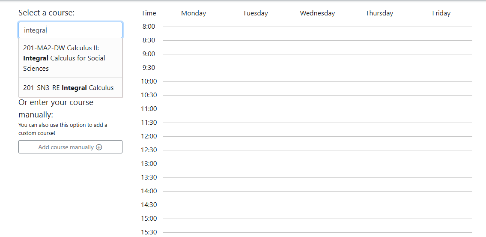
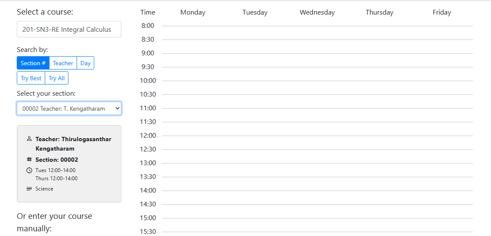
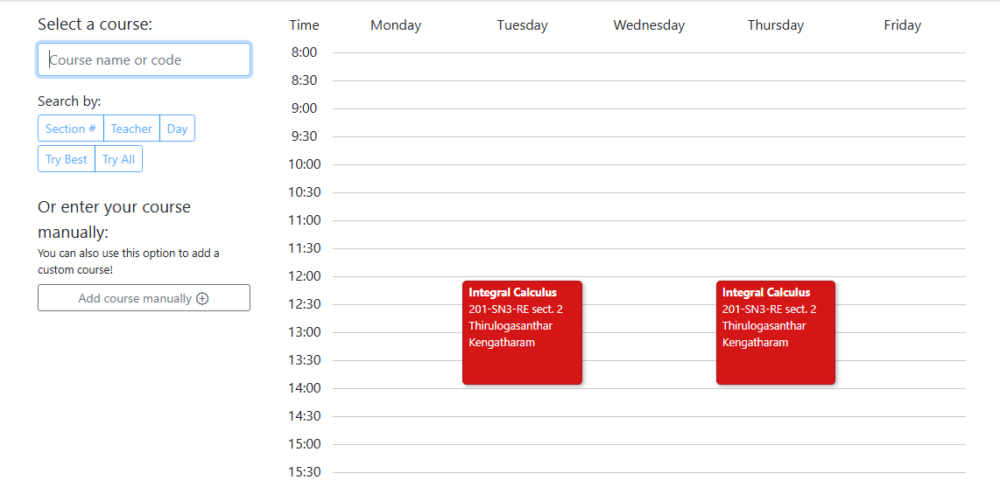
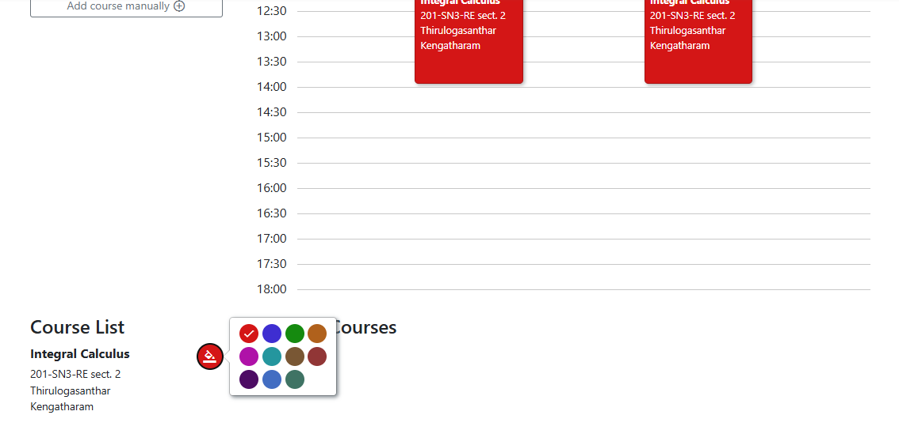
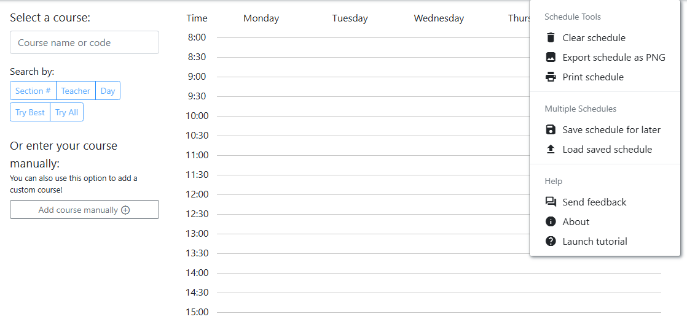

# dawson-schedule-builder
Mock schedule builder for Dawson 

Add proposed courses, search through sections of that course, and build a mock schedule in preparation for registration.

Frontend: HTML, CSS (Bootstrap), JavaScript \
Backend: Node.js, Cloudflare serverless functions \
Database: SQL, JSON

Deployed on Cloudflare pages using `wrangler`:
https://dawson-schedule-builder.pages.dev/

# Usage
1. Begin to type a course, and select from the dropdown menu:

    

2. Use the built-in filtering options to select the best section for your schedule: 

    

3. The selected course and section gets added to the schedule and can be viewed in the calendar view on the right. Repeat steps 1 and 2 for all other courses this semester.

    

4. For additional personalisation, customise course bubble colours:

    

5. Save the schedule locally to edit it later within the web app, or export it to a .png image:

    